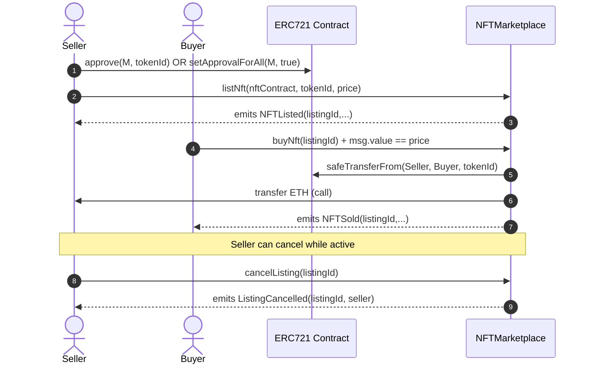

# NFT Marketplace Contract (Foundry)

A minimal **ERC-721 marketplace** smart contract built with **Foundry**.

- **Core actions**: list an NFT, buy a listed NFT, cancel a listing, update listing price
- **Safety**: uses OpenZeppelin `ReentrancyGuard` for `listNft`, `buyNft`, and `cancelListing`
- **Tests**: comprehensive unit tests covering happy paths + revert reasons

<details>
<summary><strong>Quick links</strong> (click to expand)</summary>

- [Quickstart](#quickstart)
- [Repo layout](#repo-layout)
- [Contract overview](#contract-overview)
- [Marketplace flow diagram](#marketplace-flow-diagram)
- [Contract API](#contract-api)
- [Events](#events)
- [Reverts (require messages)](#reverts-require-messages)
- [Run tests](#run-tests)
- [Deploy](#deploy)
- [Interact with the contract (Cast)](#interact-with-the-contract-cast)
- [CI](#ci)
- [Troubleshooting](#troubleshooting)
- [Security notes](#security-notes)

</details>

---

## Quickstart

### Prerequisites

- **Git** (submodules are used)
- **Foundry** (`forge`, `cast`, `anvil`)

Install Foundry:

```bash
curl -L https://foundry.paradigm.xyz | bash
foundryup
```

### Install / setup

```bash
git submodule update --init --recursive
forge --version
```

A minimal **ERC-721 marketplace** smart contract built with **Foundry**. Sellers can list NFTs for sale; buyers can purchase them with ETH. The contract runs on chains like **Sepolia** (testnet) and uses OpenZeppelin for safety.

---

## What is this?

This repo contains a **smart contract** that acts as a marketplace for ERC-721 NFTs. It does not hold your NFTs permanently—it only coordinates **listing** (seller puts an NFT up for sale), **buying** (buyer pays and receives the NFT), **cancelling** (seller removes a listing), and **updating price** (seller changes the listed price). The contract is written in **Solidity** and developed with **Foundry** (forge, cast, anvil).

---

## What you can do

- **List an NFT** – As the owner, you approve the marketplace and call `listNft(nftContract, tokenId, price)`.
- **Buy an NFT** – Send the correct ETH amount and call `buyNft(listingId)`; the NFT is transferred to you and the seller receives the payment.
- **Cancel a listing** – As the seller, call `cancelListing(listingId)` to remove your listing.
- **Update listing price** – As the seller, call `updateListingPrice(listingId, newPrice)` to change the price.

```bash
forge build
The contract uses **ReentrancyGuard** and has **unit tests** for all main flows and revert cases.

---

## Prerequisites

- **Git** (this repo uses submodules)
- **Foundry** (`forge`, `cast`, `anvil`)

Install Foundry:

```bash
curl -L https://foundry.paradigm.xyz | bash
foundryup
```

---

## Repo layout

```text
.
├── src/
│   └── NFTMarketplace.sol        # main marketplace contract
├── script/
│   └── NFTMarketplace.s.sol      # DeployScript (reads PRIVATE_KEY env var)
├── test/
│   ├── NFTMarketplace.t.sol      # unit tests
│   └── mocks/
│       └── MockNFT.sol           # simple ERC721 used in tests
├── broadcast/                    # forge script outputs (deploy receipts, addresses)
├── foundry.toml                  # Foundry configuration + remappings
└── .github/workflows/test.yml    # CI: fmt, build, test
```

---

## Contract overview

### What this marketplace stores

The marketplace keeps:

- **A monotonically increasing listing counter**: `_listingIdCounter`
- **A `listings` mapping**: `listingId -> Listing`
- **A `activeListingByNFT` mapping**: `nftContract -> tokenId -> listingIdPlusOne`

That last mapping is a small “index” to prevent double-listing the same NFT:

- It stores **`listingId + 1`** instead of `listingId`
- `0` means **“no active listing known”**
- When a listing becomes inactive, the entry is deleted

### Listing struct

Each `Listing` contains:

- **seller**: address that listed the NFT
- **nftContract**: ERC-721 contract address
- **tokenId**: token id
- **price**: in wei
- **active**: true while it can be bought/cancelled/updated

---

## Marketplace flow diagram



---

## Contract API

<details>
<summary><strong>Read this if you’re integrating from a frontend</strong> (click to expand)</summary>

### `listNft(address nftContract, uint256 tokenId, uint256 price) -> uint256 listingId`

- **Who can call**: only the current ERC-721 owner of `tokenId`
- **Requires**:
  - `price > 0`
  - `nftContract != address(0)`
  - `IERC721(nftContract).ownerOf(tokenId) == msg.sender`
  - marketplace is approved (`isApprovedForAll` OR `getApproved(tokenId)`)
  - the NFT is not already actively listed
- **State changes**:
  - creates `Listing` at `listings[listingId]`
  - sets `activeListingByNFT[nftContract][tokenId] = listingId + 1`
- **Emits**: `NFTListed(listingId, seller, nftContract, tokenId, price)`

### `buyNft(uint256 listingId)` (payable)

- **Who can call**: anyone except the seller
- **Requires**:
  - listing is active
  - `msg.value == listing.price`
  - `msg.sender != listing.seller`
- **State changes**:
  - marks listing inactive
  - deletes `activeListingByNFT[nftContract][tokenId]`
- **Transfers**:
  - NFT: `safeTransferFrom(seller, buyer, tokenId)`
  - ETH: forwards `msg.value` to seller with `.call{value: msg.value}("")`
- **Emits**: `NFTSold(listingId, buyer, seller, price)`

### `cancelListing(uint256 listingId)`

- **Who can call**: only the seller
- **Requires**:
  - listing is active
  - `msg.sender == listing.seller`
- **State changes**:
  - marks listing inactive
  - deletes `activeListingByNFT[nftContract][tokenId]`
- **Emits**: `ListingCancelled(listingId, seller)`

### `updateListingPrice(uint256 listingId, uint256 newPrice)`

- **Who can call**: only the seller
- **Requires**:
  - listing is active
  - `msg.sender == listing.seller`
  - `newPrice > 0`
- **State changes**:
  - updates `listing.price`
- **Emits**: `ListingPriceUpdated(listingId, newPrice)`

### Read-only helpers

- `getListing(uint256 listingId) -> (seller, nftContract, tokenId, price, active)`
- `getTotalListings() -> uint256`
- Public mappings:
  - `listings(listingId) -> Listing`
  - `activeListingByNFT(nftContract, tokenId) -> listingIdPlusOne`

</details>

---

## Events

- **`NFTListed(uint256 listingId, address seller, address nftContract, uint256 tokenId, uint256 price)`**
- **`NFTSold(uint256 listingId, address buyer, address seller, uint256 price)`**
- **`ListingCancelled(uint256 listingId, address seller)`**
- **`ListingPriceUpdated(uint256 listingId, uint256 newPrice)`**

---

## Reverts (require messages)

These are the exact revert strings used by `NFTMarketplace.sol`:

- **Listing**
  - `Price must be greater than 0`
  - `Invalid NFT contract`
  - `Not the NFT Owner`
  - `Marketplace not approved`
  - `NFT already listed`
- **Buying**
  - `Listing not active`
  - `Incorrect Price`
  - `Cannot buy your own NFT`
  - `Payment transfer failed`
- **Cancel / update price**
  - `Listing not active`
  - `Not the seller`
  - `Price must be greater than 0`

---

## Run tests

### Unit tests

## Quick start in 3 steps

**1. Clone and set up (including submodules)**

```bash
git submodule update --init --recursive
forge --version
```

**2. Build**

```bash
forge build
```

**3. Run tests**

```bash
forge test -vvv
```

### What’s covered

The suite in `test/NFTMarketplace.t.sol` covers:

- **Listing**: success, event emission, and all revert paths
- **Buying**: success, event emission, wrong price, inactive listing, buying own listing
- **Relisting**: allowed after purchase and after cancel
- **Cancel**: success, event emission, not-seller revert, already-inactive revert
- **Update price**: success, event emission, not-seller revert, inactive revert, zero-price revert

---

## Deploy

### Local deploy (Anvil)

Terminal A:

```bash
anvil
```

Terminal B (use any Anvil private key):

```bash
export PRIVATE_KEY="0xYOUR_ANVIL_PRIVATE_KEY"
forge script script/NFTMarketplace.s.sol:DeployScript --rpc-url http://127.0.0.1:8545 --broadcast -vvv
```

### Testnet deploy (Sepolia)

This repo already contains a **previous Sepolia deploy** recorded by Foundry:

- **Network**: Sepolia (chain id `11155111`)
- **Contract**: `NFTMarketplace`
- **Address (from `broadcast/.../run-latest.json`)**: `0x14098c94258118087820b477bd2b9a38e3ce5371`

To deploy again:

```bash
export SEPOLIA_RPC_URL="https://sepolia.infura.io/v3/YOUR_KEY"
export PRIVATE_KEY="0xYOUR_PRIVATE_KEY"

forge script script/NFTMarketplace.s.sol:DeployScript --rpc-url "$SEPOLIA_RPC_URL" --broadcast -vvv
```

> Note: `DeployScript` reads `PRIVATE_KEY` via `vm.envUint("PRIVATE_KEY")`, so you must export it (or load it via your shell/environment).

---

## Interact with the contract (Cast)

<details>
<summary><strong>Step-by-step example (approve → list → buy)</strong> (click to expand)</summary>

You’ll need:

- an **ERC-721 contract address** (`NFT_CONTRACT`)
- a **token id** (`TOKEN_ID`) owned by the seller
- the **marketplace address** (`MARKETPLACE`)
- an RPC URL

### 1) Approve the marketplace (seller)

Approve a single token:

```bash
cast send "$NFT_CONTRACT" "approve(address,uint256)" "$MARKETPLACE" "$TOKEN_ID" \
  --rpc-url "$RPC_URL" --private-key "$SELLER_PRIVATE_KEY"
```

If all three work, you’re ready to explore the contract, deploy locally, or deploy to Sepolia.

---

<details>
<summary><strong>Quick links</strong> (click to expand)</summary>

- [Project structure](#project-structure)
- [Key concepts](#key-concepts)
- [Contract overview](#contract-overview)
- [Marketplace flow diagram](#marketplace-flow-diagram)
- [Run tests](#run-tests)
- [Deploy](#deploy)
- [Interact with the contract (Cast)](#interact-with-the-contract-cast)
- [Contract API](#contract-api)
- [Events](#events)
- [Reverts (require messages)](#reverts-require-messages)
- [Troubleshooting](#troubleshooting)
- [Security notes](#security-notes)
- [CI](#ci)

</details>

---

## Project structure

```text
.
├── src/
│   └── NFTMarketplace.sol        # main marketplace contract
├── script/
│   └── NFTMarketplace.s.sol     # DeployScript (reads PRIVATE_KEY env var)
├── test/
│   ├── NFTMarketplace.t.sol     # unit tests
│   └── mocks/
│       └── MockNFT.sol          # simple ERC721 used in tests
├── broadcast/                   # forge script outputs (deploy receipts, addresses)
├── foundry.toml                 # Foundry configuration + remappings
└── .github/workflows/test.yml   # CI: fmt, build, test
```

---

## Key concepts

- **Listing** – A listing is one NFT (from a given contract + token ID) offered at a price. Each listing has a unique `listingId`. When someone buys or the seller cancels, the listing becomes inactive.
- **Approval** – Before listing, the NFT owner must **approve** the marketplace to move that NFT (via `approve(marketplace, tokenId)` or `setApprovalForAll(marketplace, true)`). Otherwise the marketplace cannot transfer the NFT on buy.
- **Seller / Buyer** – The **seller** is the address that listed the NFT; the **buyer** is the address that calls `buyNft` and sends ETH. The contract sends the NFT to the buyer and forwards ETH to the seller.

---

## Contract overview

### What this marketplace stores

The marketplace keeps:

- **A monotonically increasing listing counter**: `_listingIdCounter`
- **A `listings` mapping**: `listingId -> Listing`
- **A `activeListingByNFT` mapping**: `nftContract -> tokenId -> listingIdPlusOne`

That last mapping prevents double-listing the same NFT:

- It stores **`listingId + 1`** instead of `listingId`
- `0` means **“no active listing”**
- When a listing becomes inactive, the entry is deleted

### Listing struct

Each `Listing` contains:

- **seller**: address that listed the NFT
- **nftContract**: ERC-721 contract address
- **tokenId**: token id
- **price**: in wei
- **active**: true while it can be bought/cancelled/updated

---

## Marketplace flow diagram


---

## Run tests

### Unit tests

```bash
forge test -vvv
```

### What’s covered

The suite in `test/NFTMarketplace.t.sol` covers:

- **Listing**: success, event emission, and all revert paths
- **Buying**: success, event emission, wrong price, inactive listing, buying own listing
- **Relisting**: allowed after purchase and after cancel
- **Cancel**: success, event emission, not-seller revert, already-inactive revert
- **Update price**: success, event emission, not-seller revert, inactive revert, zero-price revert

---

## Deploy

### Local deploy (Anvil)

Terminal A:

```bash
anvil
```

Terminal B (use any Anvil private key):

```bash
export PRIVATE_KEY="0xYOUR_ANVIL_PRIVATE_KEY"
forge script script/NFTMarketplace.s.sol:DeployScript --rpc-url http://127.0.0.1:8545 --broadcast -vvv
```

### Testnet deploy (Sepolia)

This repo already contains a **previous Sepolia deploy** recorded by Foundry:

- **Network**: Sepolia (chain id `11155111`)
- **Contract**: `NFTMarketplace`
- **Address (from `broadcast/.../run-latest.json`)**: `0x14098c94258118087820b477bd2b9a38e3ce5371`

To deploy again:

```bash
export SEPOLIA_RPC_URL="https://sepolia.infura.io/v3/YOUR_KEY"
export PRIVATE_KEY="0xYOUR_PRIVATE_KEY"

forge script script/NFTMarketplace.s.sol:DeployScript --rpc-url "$SEPOLIA_RPC_URL" --broadcast -vvv
```

> Note: `DeployScript` reads `PRIVATE_KEY` via `vm.envUint("PRIVATE_KEY")`, so you must export it (or load it via your shell/environment).

---

## Interact with the contract (Cast)

<details>
<summary><strong>Step-by-step example (approve → list → buy)</strong> (click to expand)</summary>

You’ll need:

- an **ERC-721 contract address** (`NFT_CONTRACT`)
- a **token id** (`TOKEN_ID`) owned by the seller
- the **marketplace address** (`MARKETPLACE`)
- an RPC URL

### 1) Approve the marketplace (seller)

Approve a single token:

```bash
cast send "$NFT_CONTRACT" "approve(address,uint256)" "$MARKETPLACE" "$TOKEN_ID" \
  --rpc-url "$RPC_URL" --private-key "$SELLER_PRIVATE_KEY"
```

Or approve all tokens:

```bash
cast send "$NFT_CONTRACT" "setApprovalForAll(address,bool)" "$MARKETPLACE" true \
  --rpc-url "$RPC_URL" --private-key "$SELLER_PRIVATE_KEY"
```

### 2) List the NFT (seller)

```bash
cast send "$MARKETPLACE" "listNft(address,uint256,uint256)(uint256)" "$NFT_CONTRACT" "$TOKEN_ID" "$PRICE_WEI" \
  --rpc-url "$RPC_URL" --private-key "$SELLER_PRIVATE_KEY"
```

### 3) Buy the NFT (buyer)

```bash
cast send "$MARKETPLACE" "buyNft(uint256)" "$LISTING_ID" \
  --value "$PRICE_WEI" --rpc-url "$RPC_URL" --private-key "$BUYER_PRIVATE_KEY"
```

</details>

---

## CI

GitHub Actions workflow `test.yml` runs on push/PR:

- `forge fmt --check`
- `forge build --sizes`
- `forge test -vvv`

## Contract API

<details>
<summary><strong>Read this if you’re integrating from a frontend</strong> (click to expand)</summary>

### `listNft(address nftContract, uint256 tokenId, uint256 price) -> uint256 listingId`

- **Who can call**: only the current ERC-721 owner of `tokenId`
- **Requires**:
  - `price > 0`
  - `nftContract != address(0)`
  - `IERC721(nftContract).ownerOf(tokenId) == msg.sender`
  - marketplace is approved (`isApprovedForAll` OR `getApproved(tokenId)`)
  - the NFT is not already actively listed
- **State changes**:
  - creates `Listing` at `listings[listingId]`
  - sets `activeListingByNFT[nftContract][tokenId] = listingId + 1`
- **Emits**: `NFTListed(listingId, seller, nftContract, tokenId, price)`

### `buyNft(uint256 listingId)` (payable)

- **Who can call**: anyone except the seller
- **Requires**:
  - listing is active
  - `msg.value == listing.price`
  - `msg.sender != listing.seller`
- **State changes**:
  - marks listing inactive
  - deletes `activeListingByNFT[nftContract][tokenId]`
- **Transfers**:
  - NFT: `safeTransferFrom(seller, buyer, tokenId)`
  - ETH: forwards `msg.value` to seller with `.call{value: msg.value}("")`
- **Emits**: `NFTSold(listingId, buyer, seller, price)`

### `cancelListing(uint256 listingId)`

- **Who can call**: only the seller
- **Requires**:
  - listing is active
  - `msg.sender == listing.seller`
- **State changes**:
  - marks listing inactive
  - deletes `activeListingByNFT[nftContract][tokenId]`
- **Emits**: `ListingCancelled(listingId, seller)`

### `updateListingPrice(uint256 listingId, uint256 newPrice)`

- **Who can call**: only the seller
- **Requires**:
  - listing is active
  - `msg.sender == listing.seller`
  - `newPrice > 0`
- **State changes**:
  - updates `listing.price`
- **Emits**: `ListingPriceUpdated(listingId, newPrice)`

### Read-only helpers

- `getListing(uint256 listingId) -> (seller, nftContract, tokenId, price, active)`
- `getTotalListings() -> uint256`
- Public mappings:
  - `listings(listingId) -> Listing`
  - `activeListingByNFT(nftContract, tokenId) -> listingIdPlusOne`

</details>

---

## Events

- **`NFTListed(uint256 listingId, address seller, address nftContract, uint256 tokenId, uint256 price)`**
- **`NFTSold(uint256 listingId, address buyer, address seller, uint256 price)`**
- **`ListingCancelled(uint256 listingId, address seller)`**
- **`ListingPriceUpdated(uint256 listingId, uint256 newPrice)`**

---

## Reverts (require messages)

These are the exact revert strings used by `NFTMarketplace.sol`:

- **Listing**
  - `Price must be greater than 0`
  - `Invalid NFT contract`
  - `Not the NFT Owner`
  - `Marketplace not approved`
  - `NFT already listed`
- **Buying**
  - `Listing not active`
  - `Incorrect Price`
  - `Cannot buy your own NFT`
  - `Payment transfer failed`
- **Cancel / update price**
  - `Listing not active`
  - `Not the seller`
  - `Price must be greater than 0`
  
---

## Troubleshooting

<details>
<summary><strong>“Marketplace not approved” when listing</strong></summary>

The marketplace requires either:

- `getApproved(tokenId) == marketplace`, or
- `isApprovedForAll(owner, marketplace) == true`

Approve first using `approve` or `setApprovalForAll`.

</details>

<details>
<summary><strong>“Listing not active” when buying / cancelling / updating</strong></summary>

Listings become inactive after:

- a successful `buyNft`, or
- a successful `cancelListing`

Re-list the NFT to create a new active listing.

</details>

<details>
<summary><strong>Buying fails with safeTransferFrom</strong></summary>

`buyNft` calls `safeTransferFrom(seller, buyer, tokenId)`.

- If the buyer is a contract, it must implement ERC-721 receiver (`onERC721Received`) or the transfer will revert.

</details>

---

## Security notes

This is a learning/demo marketplace and is **not audited**.

Important considerations:

- **Funds forwarding**: ETH is forwarded to the seller via `.call`. If it fails, the buy reverts (`Payment transfer failed`).
- **Approval dependency**: listing requires marketplace approval, but the seller could revoke approval after listing; then `buyNft` may revert at transfer time.
- **No fees / no escrow**: the contract does not escrow NFTs or charge marketplace fees.
- **No listing expiration**: listings stay active until bought/cancelled.

---

## CI

GitHub Actions workflow `test.yml` runs on push/PR:

- `forge fmt --check`
- `forge build --sizes`
- `forge test -vvv`

---

## Foundry reference

- Foundry book: `https://book.getfoundry.sh/`
